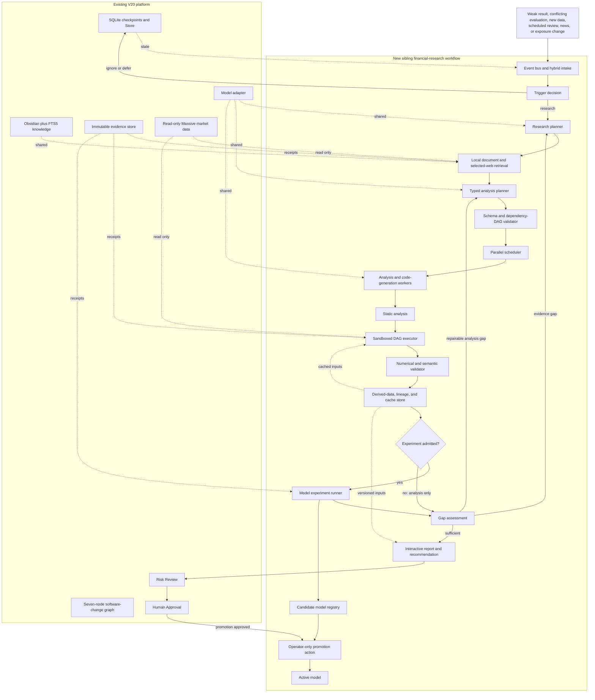

# Autonomous Financial Research and Model Experiment Engine

- Status: Accepted
- Date: 2026-07-29
- Owner: V20 operator
- Decision: Option B -- autonomous research and model experiments with manual
  model promotion
- Review date: 2026-08-12, reconsider Option C -- automatic promotion

## Goal

Add a PAT-like analytical engine to V20 that can detect an information gap,
research it, build and execute a typed financial-analysis plan, run local model
experiments, assess the result, and repeat when justified. The system should be
autonomous during ordinary research while preserving human control over active
model promotion, trading, capital, risk limits, credentials, paid services, and
live scheduling changes.

This is a sibling workflow, not a replacement for the existing seven-node
software-change workflow. Both workflows share controller-owned persistence,
knowledge, evidence, model adapters, and authority policy.

## Current-to-target architecture



## What is reused and what is missing today

| Capability | Existing V20 | New work |
|---|---|---|
| Controller-owned state | SQLite checkpoints and Store | Add event and research-run state |
| Knowledge | Obsidian canonical notes plus FTS5 | Add source-aware research retrieval |
| Evidence | Immutable artifact receipts | Add web, dataset, analysis, and experiment receipts |
| Market data | Read-only local Massive inspection | Add typed analytical queries and derived outputs |
| Model access | Existing adapter | Reuse for planning and parallel worker generation |
| Workflow | Sequential software-change graph | Add sibling typed financial-analysis DAG |
| Validation | Code and workflow checks | Add point-in-time, leakage, numerical, and experiment checks |
| Autonomy | Predetermined graph with repair loops | Add event triggers, research-gap loops, caching, and experiments |
| Training | Artifact evaluation only | Add admitted local experiment and training runner |
| Promotion | Human approval node | Keep active-model replacement manual |
| Web research | Not present | Add search plus selected article and PDF retrieval |

## Operating flow

1. An event or user request enters hybrid intake.
2. Deterministic checks decide whether the event is relevant, novel, and
   actionable. Straightforward requests proceed automatically; material
   ambiguity pauses for the operator.
3. The research planner converts the gap into bounded questions and chooses
   local market data, repository documents, or selected external sources.
4. Retrieval records source identity, retrieval time, content hash, market-time
   applicability, and citations. It may search broadly but retrieves only the
   specific articles or PDFs needed for the questions; it is not a site crawler.
5. The analysis planner produces typed dataframe inputs, transformations,
   dependencies, expected schemas, metrics, charts, and experiment criteria.
6. The plan validator rejects cycles, missing columns, unsafe operations,
   invalid temporal joins, and unavailable inputs before execution.
7. Independent tasks are scheduled in parallel. Existing model adapters generate
   task code or analytical steps, while deterministic transforms remain ordinary
   code.
8. Static analysis checks generated code before it enters the sandbox. The
   executor runs the validated DAG with read-only source mounts and a separate
   writable derived-data area.
9. Numerical and semantic validation checks schemas, invariants, split
   adjustment, timestamp alignment, look-ahead leakage, benchmark definitions,
   and reproducibility.
10. Validated analytical outputs are written as immutable, versioned derived
    datasets before any experiment consumes them.
11. When admitted by an experiment contract, the model runner consumes a
    derived-dataset version, trains candidate models using local compute, and
    evaluates them on frozen holdouts. Analysis-only runs bypass this step.
12. Gap assessment decides whether evidence is sufficient, another targeted
    research pass is justified, the analysis needs repair, or the run should
    stop with a clear unresolved finding.
13. Validated outputs become an interactive report and recommendation. Candidate
    models enter an inactive registry but cannot replace the active model without
    a separate operator-only promotion action.

## Core contracts

Every contract includes `run_id`, `event_id`, creation time, source or model
versions, content hashes, confidence or validation state, evidence references,
and parent-child lineage.

```text
EventEnvelope
  -> TriggerDecision
  -> ResearchRequest
  -> AnalysisPlan
  -> DerivedDataset
  -> [ExperimentResult when admitted]
  -> GapAssessment
  -> Recommendation

GapAssessment(evidence_missing) -> ResearchRequest
GapAssessment(analysis_defect)   -> AnalysisPlan
```

- `EventEnvelope`: typed event, occurrence time, observed time, affected symbols,
  origin, deduplication key, and payload reference.
- `TriggerDecision`: relevance, novelty, urgency, reason, chosen workflow, and
  resource budget.
- `ResearchRequest`: bounded questions, source classes, time window, symbols,
  sufficiency criteria, and prior-attempt references.
- `AnalysisPlan`: typed datasets, transformations, dependency edges, schemas,
  metrics, charts, experiment contract, and acceptance checks.
- `DerivedDataset`: immutable version, schema, source hashes, transform hash,
  time coverage, lineage, cache key, and validation receipt.
- `ExperimentResult`: dataset version, code and environment hashes, parameters,
  seeds, fold definitions, benchmarks, metrics, artifacts, and failure status.
- `GapAssessment`: supported claims, unresolved gaps, contradiction state,
  confidence, next action, and loop-budget use.
- `Recommendation`: conclusions, evidence and citations, uncertainty, model
  candidate references, risk-review input, and explicit non-authority statement.

## Initial event types

- weak model result;
- conflicting evaluation;
- new market data;
- scheduled review;
- discovered news or filing;
- portfolio exposure change; and
- direct operator request.

The interface accepts all event types from the start. Initial implementation may
activate only direct requests and weak-result events until their end-to-end
behavior is verified.

## Derived-data and cache design

Raw Massive data and repository research documents remain read-only. Generated
tables, features, charts, source extracts, and experiment outputs default to the
controller-owned `PlatformPaths.root / "derived"` root. Startup validation must
confirm the resolved location is outside the repository and specifically outside
`vesper/data/massive/` and `vesper/data/model_research/`.

A cache entry is reusable only when all of these match:

- source hashes and point-in-time cutoffs;
- transformation or generated-code hash;
- input and output schemas;
- dependency versions and execution environment;
- experiment parameters and random seeds; and
- applicable validation-policy version.

Changing any dependency invalidates that entry and its descendants. Reports
refer to immutable dataset and experiment versions rather than mutable paths.

## Autonomy and stop rules

The system proceeds without routine approval through retrieval, planning,
parallel analysis, repair, local experiment training, and reporting. These are
circuit breakers for bad or wasteful runs, not extra approval stages:

- no more than three repair attempts for the same failed task;
- no more than two research expansions without new material evidence;
- duplicate event, query, source, and dataset hashes reuse prior work;
- every run has explicit time, storage, model-call, and local-compute budgets;
- conflicting high-impact evidence or unresolved intent pauses for the operator;
- credentials, paid data or compute, risk-limit changes, scheduler changes,
  broker access, capital actions, orders, deployment, and active-model promotion
  always require separate authority; and
- exhausting a budget returns the best supported partial result and exact gap,
  rather than fabricating completion.

## Model experiment and promotion boundary

Automatic experiments are permitted only under an admitted contract defining:

- objective and benchmark;
- immutable training, validation, and holdout windows;
- feature and target definitions;
- leakage checks and split-adjustment policy;
- metric thresholds and uncertainty estimates;
- local resource ceiling; and
- artifact and reproducibility requirements.

Successful candidates are registered as inactive. Promotion produces a review
packet comparing the candidate with the active model, including failure cases,
cost, robustness, data lineage, and rollback information. Only the operator can
approve replacement of the active artifact.

## Reports

The report must expose:

- the initiating event and research questions;
- sources with direct citations and applicability times;
- the executed DAG and reused cache entries;
- charts, tables, benchmark comparisons, and uncertainty;
- candidate experiment results and rejected alternatives;
- remaining evidence gaps or contradictions;
- the recommendation and its limits; and
- the exact manual action required if promotion is recommended.

The report can feed the existing Risk Review path. It never constitutes trade,
capital-allocation, deployment, or promotion authority.

## Implementation plan

### Phase 1 -- Thin end-to-end analysis slice

Add the contracts, sibling workflow, direct-request and weak-result intake,
typed DAG validator, one local-data analysis path, derived-data receipts, and a
report. Prove one event can reach a reproducible conclusion without changing the
active model.

### Phase 2 -- Parallel execution and bounded repair

Add the scheduler, parallel task workers through the existing model adapter,
static analysis, sandbox execution, cache reuse, numerical validation, and the
repair loop.

### Phase 3 -- Autonomous evidence retrieval

Add repository-document search, web search, selected article and PDF retrieval,
source hashing, citations, time applicability, research-gap expansion, and
duplicate-research detection.

### Phase 4 -- Automatic local model experiments

Add experiment admission contracts, dataset freezing, candidate training,
benchmark evaluation, the inactive candidate registry, and a manual-promotion
review packet.

### Phase 5 -- Event sources and operational hardening

Activate market-data, news, and exposure-change events and prepare a
scheduled-review adapter. Add event deduplication, backpressure, run budgets,
recovery, observability, and integration into the existing Risk Review and Human
Approval path. Activating or changing an operating-system or external scheduler
remains a separate operator-approved action.

Each phase must end in a working vertical capability. Do not build every guard
or abstraction before demonstrating an end-to-end result.

## Acceptance criteria

1. A weak result can automatically trigger a bounded research and analysis run.
2. The planner emits a valid, acyclic, typed dataframe DAG before execution.
3. Independent tasks run in parallel and deterministic results are cached.
4. Raw market and research sources remain read-only; derived outputs carry full
   lineage and invalidation metadata.
5. Web findings retain source identity, retrieval time, hash, citations, and
   point-in-time applicability.
6. Invalid schemas, unsafe generated code, temporal leakage, and irreproducible
   experiments fail before a recommendation is accepted.
7. A justified evidence gap can automatically start another targeted research
   pass within budget.
8. Admitted local model experiments can train and register inactive candidates
   without replacing the active artifact.
9. Every recommendation shows evidence, uncertainty, remaining gaps, and the
   precise human decision still required.
10. No path can place orders, change capital or risk limits, use paid resources,
    modify the scheduler, or promote a model without separate operator approval.
11. The existing seven-node software-change workflow continues to operate
    independently while sharing platform infrastructure.

## Deferred decision

On 2026-08-12, review evidence from Option B and reconsider Option C: allowing
automatic promotion. Promotion should be considered only if the candidate
registry, shadow comparison, rollback, drift monitoring, and false-promotion
tests have demonstrated that the automatic decision is more reliable than the
manual gate.
