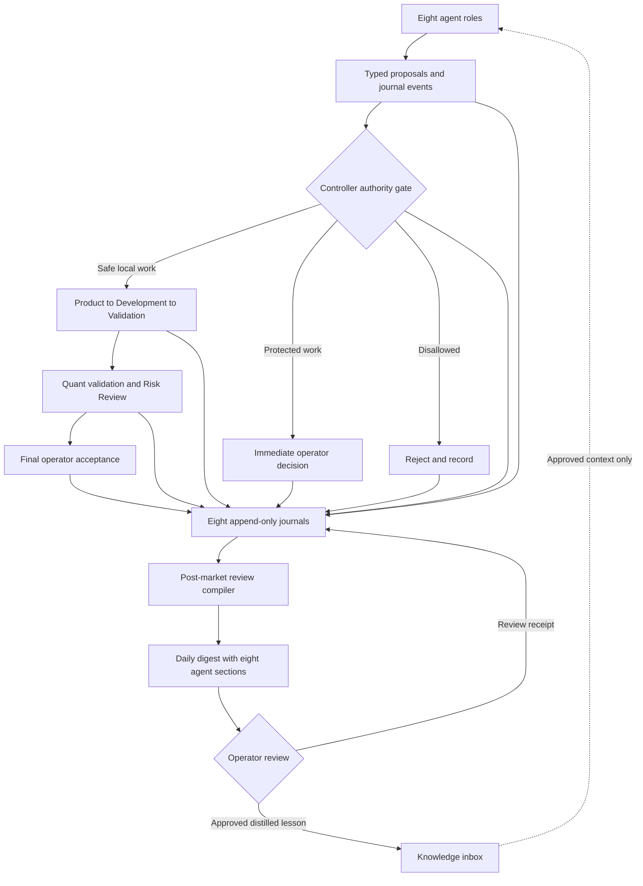

# Bounded Agent Autonomy and Daily Journals

- Status: Approved design
- Date: 2026-08-02
- Owner: V20 operator
- Scope: Agent initiative, proposal routing, per-agent journals, and post-market review

## Goal

Let every V20 agent identify opportunities and propose work without giving any
agent unrestricted authority. Preserve a complete, human-readable journal for
each agent and require a hybrid operator review after every trading session.

The review is an accountability and next-session control. It is not a delayed
substitute for approvals that must happen before protected work begins.

## Current and target agents

The current platform has three native specialist agents:

1. `v20-product` turns admitted work into a bounded implementation brief.
2. `v20-development` is the only agent that may edit its controller-granted
   workspace.
3. `v20-risk-review` independently reviews evidence and protected boundaries.

The target core quant team adds five proposed agents:

4. `v20-quant-research-lead` frames hypotheses and routes research work.
5. `v20-model-research` evaluates model and feature ideas in research-only scope.
6. `v20-independent-quant-validation` independently challenges research claims.
7. `v20-portfolio-research` studies construction, exposures, and allocation ideas
   without changing live limits or capital.
8. `v20-execution-performance` analyzes fills, costs, slippage, and operational
   performance without order authority.

The five proposed roles are target architecture, not current implementation.
The controller, validation services, trading engine, and daily review compiler
remain deterministic services rather than additional agents.

The controller maintains the fixed eight-role roster with an explicit status for
each role: `active`, `disabled`, or `not_implemented`. A role that does not yet run
still appears truthfully in the daily digest with its status and no activity.

## Local model strategy

The autonomous local-agent pool uses only Ollama model `qwen:64k`. It is the sole
automatic local model and is configured with a 65,536-token context window. The
controller must not silently substitute another local or remote model when it is
unavailable; affected work remains queued or fails closed with a journal event.

One Ollama model service is shared by isolated logical agent turns. Each role has
its own profile, context snapshot, memory namespace, task state, and journal. The
roles never share one conversation. The controller permits one active Qwen
inference at a time and queues the rest. This avoids eight model copies and keeps
GPU use predictable.

Existing Codex and OpenCode adapters remain explicit operator-selected execution
paths, not automatic members of the autonomous local pool. Adding a second local
model, automatic model fallback, or parallel Qwen inference requires a separate
evidence-backed design change.

Because all local roles use the same weights, role independence is procedural,
not model-diverse. Independent Quant Validation and Risk Review therefore receive
fresh isolated contexts, separate instructions and memory, artifact evidence
rather than the producing agent's private reasoning, deterministic checks, and a
final human gate. The system must not describe this as independent-model review.

## Architecture

Every proposal enters through the controller. An agent cannot act directly on
its own proposal, change its authority, validate itself, or approve its outcome.

## Operating cadence

Real-time market, order, data-quality, and risk monitoring remains deterministic
and separate from AI inference. Agents wake on admitted work or scheduled review;
they do not run endless reasoning loops.

- Product runs when a new safe proposal is admitted.
- Development runs after an accepted Product brief or a bounded correction.
- Risk Review runs after deterministic validation completes.
- Quant Research Lead runs once after each trading session and on a material
  evidence trigger.
- Model Research runs for a routed research job, normally post-market or overnight.
- Independent Quant Validation runs after every research or model result.
- Portfolio Research runs after each trading session, with a deeper weekly review.
- Execution Performance receives live deterministic metrics but invokes Qwen only
  after a material anomaly settles for one to five minutes or during post-market
  review.
- Journal writes occur synchronously with each meaningful controller transition.
- The daily digest is eligible at the official exchange close plus 15 minutes,
  including early-close sessions.

The queue orders operator-started work first, then admitted corrections and
validation, material anomaly review, scheduled research, and routine summaries.
Repeated equivalent triggers within five minutes collapse into one queued item
with updated evidence. Scheduling these turns remains a protected implementation
step requiring separate operator approval.

## Bounded initiative

Every agent may autonomously:

- record an evidence-backed observation;
- suggest a code, test, documentation, research, or process change;
- identify a contradiction, defect, data-quality issue, or missed opportunity;
- request routing to another agent or deterministic service; and
- recommend that an item be rejected, deferred, or escalated.

The controller assigns one of three authority classes:

### Safe local

Read-only analysis or a narrow reversible proposal involving local code,
documentation, or tests may enter the Product and Development workflow without
advance operator approval. Development alone receives a bounded write workspace.
Deterministic validation, independent review, and final operator acceptance still
apply.

### Protected

Broker, order, position, account, credential, provider, risk-limit, trading
parameter, capital-allocation, live-deployment, scheduler, paid-compute,
model-training, model-promotion, active-artifact, protected-data-write, or
destructive proposals stop for immediate operator approval. The daily review
cannot retroactively authorize them.

### Disallowed

Proposals outside policy, lacking required evidence, containing prohibited data,
or attempting to bypass a gate are rejected and journaled. No fallback route may
weaken the boundary.

## Proposal contract

An agent submits a typed `AgentProposal` containing:

- stable proposal, run, task, and agent identifiers;
- trading-session date and UTC creation time;
- concise title and rationale summary;
- proposal category and requested route;
- evidence references and immutable hashes;
- affected files or systems;
- expected benefit and bounded downside;
- requested authority class;
- validation required for acceptance; and
- dependencies, conflicts, and expiration time when applicable.

The rationale is a concise decision explanation, not private chain-of-thought.
Raw prompts, hidden reasoning, credentials, secrets, and raw protected market
data are prohibited.

## Qwen tool and skill gateway

Qwen supports structured tool calls, but it never executes host tools directly.
The controller supplies a small role-specific schema allowlist, validates each
requested call and its arguments, executes the allowed operation, records the
receipt, and returns only the bounded result. The initial implementation stops a
turn after eight tool calls with no automatic exception.

The default role boundaries are:

- Product: read and search.
- Development: read, search, write, and test inside its exact granted workspace.
- Research roles: approved read-only data, evidence, and research queries.
- Independent Quant Validation and Risk Review: read, search, and evidence checks.
- Execution Performance: read-only fills, costs, and performance records.
- Every role: no broker, order, position, credential, provider, scheduler,
  risk-control, protected-write, unrestricted shell, or arbitrary network tools.

Skills are bounded instruction documents, not executable model capabilities. The
controller selects only the approved skills required for the role and task, adds
their bounded contents and immutable references to the context snapshot, and never
exposes arbitrary skill discovery or direct skill-file access to Qwen.

The 65,536-token window is budgeted across the complete tool loop:

- no more than 49,152 accumulated input tokens, including returned tool results;
- at least 16,384 tokens reserved for final output;
- no more than 6,000 input tokens for role policy and authority instructions;
- no more than 6,000 input tokens for tool schemas;
- no more than 10,000 input tokens for selected skills and knowledge; and
- the remaining input budget for the task, evidence, and compact history.

Normal turns should use less than the maximum. When required evidence does not fit,
the controller retrieves a smaller relevant set or splits the work into linked
turns. It never silently drops authority rules or material contrary evidence.

## Per-agent journal

Each of the eight roles has a separate controller-owned `AgentJournal`. An agent
may propose events, but it cannot create, replace, or delete persisted records
directly.

Meaningful events use these types:

- `observation`
- `proposal_submitted`
- `route_decided`
- `work_started`
- `action_completed`
- `validation_result`
- `blocked`
- `deferred`
- `rejected`
- `operator_decision`
- `correction`

Every `JournalEvent` records:

- event ID, event type, agent, session date, and UTC time;
- related proposal, run, task, and prior-event IDs;
- concise summary and rationale summary;
- evidence references and hashes;
- requested and granted authority;
- route, status, outcome, and next action;
- affected files or systems; and
- previous-event hash and current-event hash.

The controller writes events to a role-scoped LangGraph Store namespace using
unique IDs and no update operation. Hash chaining makes later alteration
detectable. A correction is a new event pointing to the incorrect event.

The existing specialist-turn journal and immutable evidence mechanisms should be
extended rather than replaced. The daily human-readable report is a derived view;
it is not a second canonical ledger.

Journal events capture decisions and outcomes, not token traces or every tool
call. Prohibited content is rejected before persistence. A safe metadata-only
failure event records that rejection without retaining the prohibited value.

## Post-market review bundle

After the official exchange close plus a configured delay, a deterministic
compiler seals one review bundle for the trading-session date. It must use the
exchange calendar, including early-close sessions, rather than assume a fixed
clock time.

The bundle contains:

- one firm-level summary;
- one section for every agent, including explicit `no activity` sections;
- proposals opened, routed, accepted, rejected, blocked, or deferred;
- code and files changed, with diff and test evidence references;
- research claims and independent challenges;
- protected requests awaiting decisions;
- failures, contradictions, corrections, and unresolved items;
- carryover work eligible to continue next session;
- new proposals held by the hybrid review gate; and
- ordered journal hashes and a bundle hash.

The canonical records remain structured. The compiler exports a readable Markdown
digest and machine-readable JSON receipt. Re-running it over unchanged events is
idempotent and produces the same content hash.

## Hybrid review gate

The gate uses these exact rules:

1. Previously admitted work may continue next session only within its unchanged
   proposal scope and granted authority.
2. Deterministic validation and review may continue for that admitted work.
3. Agents may keep observing and journaling while review is pending.
4. A new autonomous proposal is recorded but cannot be admitted to Product,
   Development, or research execution until the prior session has an operator
   review receipt.
5. One operator acknowledgment of the complete digest opens the next-session
   safe-proposal gate. It does not approve any individual unresolved or protected
   item.
6. Rejection, evidence requests, and deferrals remain attached to their individual
   proposals until explicitly resolved.
7. Protected work always requires its own immediate approval before work begins.
8. The gate checks every completed exchange session since the last review, not
   weekends or market holidays. All sealed digests in that backlog must be
   acknowledged before new autonomous proposals are admitted.
9. Initial enablement requires a one-time operator bootstrap receipt. The system
   cannot invent a prior review or silently begin with an open gate.

If the digest is missing, corrupt, incomplete, or unsealed, the new-proposal gate
fails closed. This pauses new autonomous agent work only. It must not stop or alter
the trading engine, order controls, risk enforcement, or operator-initiated work.

## Operator review actions

The operator may:

- acknowledge the complete digest;
- approve, reject, defer, or request evidence for an individual proposal;
- allow or cancel eligible carryover work;
- add a correction or note without rewriting history; and
- approve a distilled lesson for the governed knowledge inbox.

Each action creates an append-only `OperatorReviewReceipt` with the digest hash,
decision, timestamp, affected proposal IDs, and resulting gate state.

Operational journals never become durable knowledge automatically. Only a stable,
distilled lesson explicitly approved by the operator may enter `knowledge/inbox/`.
It still follows normal knowledge review and cannot become runtime authority.

## Failure and recovery

- Duplicate event IDs or a broken hash chain fail before a write is accepted.
- Replayed events are idempotent when their complete canonical payload matches.
- A replay with different content is rejected as an integrity failure.
- Journal persistence failure prevents the related proposal transition.
- Digest compilation failure leaves the prior sealed digest unchanged and closes
  the next-session new-proposal gate.
- Missing agent activity produces a `no activity` section, not a missing section.
- Resume reuses persisted proposal authority and cannot silently widen scope.
- An unavailable agent cannot be replaced by another role with broader authority.
- Logs and diagnostics redact prohibited values before persistence or display.
- Trading execution remains operationally separate from journal review failures.

## Operator surface

The first operator surface should be CLI-first and read-only by default:

- list agent activity for a session;
- render or verify a sealed daily digest;
- inspect one agent, proposal, or hash chain;
- record a digest acknowledgment;
- record an item decision or evidence request; and
- show whether the next-session safe-proposal gate is open.

A dashboard may later render the same contracts. It must not introduce a second
decision store or bypass controller validation.

No scheduled job is activated by this design. Scheduling the post-market compiler
is a separate operator approval because scheduler changes are protected.

## Testing

Focused offline tests must prove:

1. strict proposal, journal-event, digest, and review-receipt schemas;
2. role isolation and controller-only writes;
3. append-only behavior, correction linkage, hash-chain verification, and replay
   idempotency;
4. safe, protected, and disallowed routing without authority escalation;
5. Development-only workspace writes and independent validation;
6. deterministic digest ordering, all eight sections, `no activity`, and stable
   hashes;
7. exchange-calendar handling for ordinary and early-close sessions;
8. hybrid gating for carryover, new proposals, acknowledgment, and unresolved
   protected items;
9. fail-closed behavior for missing or corrupt journals and digests;
10. secret and prohibited-content rejection without value retention;
11. separation between journals, runtime memory, durable knowledge, and trading
    authority; and
12. no effect on trading-engine availability or controls when review is pending;
13. one shared Qwen service with isolated role contexts and one active inference;
14. strict context-budget accounting across prompts, tools, results, and output;
15. controller-mediated role allowlists, the eight-call bound, and forbidden-tool
    rejection before execution;
16. approved skill selection without arbitrary discovery or direct skill access;
17. no silent model fallback when Qwen is unavailable; and
18. event, scheduled, anomaly-settling, deduplication, queue-priority, and
    exchange-calendar cadence behavior.

Before enablement, a local no-write canary against the installed `qwen:64k` must
verify structured tool-call parsing, forbidden-tool denial, context accounting,
timeout handling, and journal receipts. Passing fake-adapter tests alone does not
prove the local model is ready.

## Initial implementation boundary

The first implementation should add the shared contracts, controller-owned
journal service, proposal router, deterministic digest compiler, hybrid review
gate, CLI review surface, Ollama Qwen gateway, role-scoped tool loop, context
budgeter, single-inference queue, and focused tests. It should connect the three
existing native specialists and expose the same registration boundary for the
five future roles.

Building the five proposed agents, activating a post-market schedule, adding a
dashboard, changing trading or risk behavior, training or promoting models, and
granting broker or provider access are outside this implementation. A second
local model, automatic fallback, and parallel local inference are also outside.

## Acceptance criteria

- Every registered agent has an isolated, append-only, tamper-evident journal.
- Every proposal is evidence-backed, classified, routed, and journaled by the
  controller before work begins.
- Only Development may write, and only inside an exact granted workspace.
- Protected work cannot start through the safe route or daily review.
- Every trading session produces a sealed digest with a section for all eight
  target roles and a truthful active, disabled, or not-implemented status.
- Previously admitted work may continue while new autonomous proposals wait for
  the prior digest review.
- Digest acknowledgment opens only the safe-proposal gate and grants no protected
  authority.
- Corrections and operator decisions add records without rewriting history.
- Only explicitly approved distilled lessons may enter the governed knowledge
  inbox.
- Journal or review failure cannot alter trading, risk, broker, or order behavior.
- The autonomous local pool uses only `qwen:64k`, one inference at a time, with no
  silent model fallback.
- Each role receives an isolated context and only its approved tools and skills.
- Tool loops and complete-context use remain inside their deterministic budgets.
- Real-time monitoring remains deterministic while Qwen runs only on admitted
  events or approved scheduled review.

## Source alignment

- `vesper/platform/composition.py` for existing specialist-turn journaling and
  controller-mediated specialist execution.
- `vesper/platform/contracts.py` for strict typed boundary contracts.
- `vesper/platform/evidence.py` and `vesper/platform/persistence.py` for immutable
  evidence and Store-backed state.
- `vesper/platform/workflow.py` for correction loops and human acceptance.
- `knowledge/skills/knowledge-governance.md` for durable knowledge admission.
- `vesper/data/calendar.py` for exchange-session semantics.
- `vesper/audit/logger.py` remains the trading audit facility and is not replaced
  by agent journals.
