# Autonomous financial research engine with manual model promotion

## Decision

Adopt Option B: V20 may automatically research evidence, generate and execute
typed financial analyses, repair failed analyses, and run admitted local model
experiments. Candidate models remain inactive until the operator manually
approves promotion.

On **2026-08-12**, reconsider Option C: automatic model promotion. This is a
dated review marker in Obsidian, not an active calendar notification.

## Recommendation

Build the capability as a sibling financial-research workflow sharing V20's
existing model adapter, Obsidian and FTS5 knowledge, SQLite state, immutable
evidence, read-only Massive data, Risk Review, and Human Approval. Do not force
financial analysis through the existing seven-node software-change graph.

```mermaid
flowchart LR
    E[Event or request] --> T[Hybrid trigger decision]
    T --> R[Autonomous local and selected-web research]
    R --> P[Typed dataframe DAG planner]
    P --> V[Schema and dependency validation]
    V --> W[Parallel analysis workers]
    W --> X[Static analysis and sandbox execution]
    X --> N[Numerical, temporal, and leakage validation]
    N --> D[Versioned derived-data store]
    D --> A{Experiment admitted?}
    A -->|Yes| M[Local model experiment]
    A -->|No: analysis only| G
    M --> G{Evidence sufficient?}
    G -->|No: evidence gap| R
    G -->|No: analysis defect| P
    G -->|Yes| O[Interactive report and recommendation]
    D -. immutable inputs .-> O
    M --> C[Inactive candidate registry]
    O --> K[Existing Risk Review]
    K --> H[Human Approval]
    H -->|Promotion approved| U[Operator-only promotion action]
    C --> U
    U --> Z[Active model]
```



## Current-to-target capability map

| Capability | Existing V20 | New work |
|---|---|---|
| Controller-owned state | SQLite checkpoints and Store | Event and research-run state |
| Knowledge | Obsidian plus FTS5 | Source-aware research retrieval |
| Evidence | Immutable artifact receipts | Web, dataset, analysis, and experiment receipts |
| Market data | Read-only Massive inspection | Typed queries and derived analytical outputs |
| Model access | Existing adapter | Planner and parallel worker generation |
| Workflow | Seven-node software-change graph | Sibling typed financial-analysis DAG |
| Validation | Code and workflow checks | Point-in-time, leakage, numerical, and experiment checks |
| Autonomy | Predetermined graph and repair loops | Event triggers, research-gap loops, cache, and experiments |
| Training | Artifact evaluation only | Admitted local candidate training |
| Promotion | Human Approval | Manual operator-only active-model replacement |
| Web research | Not present | Search plus selected article and PDF retrieval |

## Automatic behavior

- Straightforward requests and events proceed without routine approval.
- Deterministic metrics identify a gap; the research planner decides what
  information to pursue.
- Research uses local structured market data, repository research documents,
  web search, and selected relevant articles or PDFs. It does not crawl entire
  sites by default.
- The planner produces typed dataframe inputs, transformations, schemas,
  metrics, charts, experiment criteria, and an acyclic dependency graph.
- Existing model adapters support the planner and parallel task-codegen workers.
- Static analysis precedes sandbox execution.
- Valid outputs are persisted before training under the default
  controller-owned `PlatformPaths.root / "derived"` root. Startup validation must
  confirm its resolved location is outside the repository and protected raw-data
  directories. Each version records source, transform, environment, model, and
  validation lineage.
- Analysis-only runs bypass training. When an experiment is admitted, it consumes
  an immutable derived-dataset version.
- A supported evidence gap automatically triggers another targeted research
  pass; an analysis defect returns to planning and repair.
- Admitted experiments may train candidates on local compute and frozen
  datasets. Candidates enter an inactive registry.
- Reports include citations, charts, benchmarks, uncertainty, rejected
  alternatives, remaining gaps, and the exact human decision required.

## Event interface

Initial event types are weak model result, conflicting evaluation, new market
data, scheduled review, news discovery, portfolio exposure change, and direct
operator request. The first implementation may activate only direct requests
and weak-result events, while preserving the generic interface.

The contract chain is:

```text
EventEnvelope
  -> TriggerDecision
  -> ResearchRequest
  -> AnalysisPlan
  -> DerivedDataset
  -> [ExperimentResult when admitted]
  -> GapAssessment
  -> Recommendation

GapAssessment(evidence_missing) -> ResearchRequest
GapAssessment(analysis_defect)   -> AnalysisPlan
```

Every object records run and event IDs, time, source or model versions, hashes,
confidence or validation state, evidence references, and parent-child lineage.

## Source, lineage, and cache rules

External findings record source identity, retrieval time, content hash, direct
citation, and market-time applicability. Search may be broad, but retrieval is
limited to the specific articles and PDFs needed for the research questions.

A derived result is reusable only when source hashes and point-in-time cutoffs,
transform or generated-code hash, schemas, dependency and environment versions,
experiment parameters and seeds, and validation-policy version all match.
Changing any dependency invalidates that result and its descendants. Reports
refer to immutable dataset and experiment IDs rather than mutable paths.

## Minimal circuit breakers

These limits prevent broken or wasteful autonomy without adding routine gates:

- three repair attempts for the same failed task;
- two research expansions without new material evidence;
- deduplication by event, query, source, dataset, and transform hashes;
- explicit time, storage, model-call, and local-compute budgets;
- operator pause for unresolved intent or conflicting high-impact evidence; and
- a best-supported partial report when a budget is exhausted.

Credentials, paid data or compute, scheduler changes, broker access, orders,
capital or risk changes, deployment, and active-model promotion still require
separate operator authority.

## Model experiment contract

Automatic local training is allowed only when an admitted contract defines the
objective and benchmark, immutable train/validation/holdout windows, features and
target, split-adjustment and leakage checks, metrics and uncertainty thresholds,
local resource ceiling, and reproducibility artifacts. Successful candidates are
registered as inactive.

A promotion packet compares the candidate with the active model, including
failure cases, robustness, cost, lineage, and rollback information. Human
approval authorizes a separate operator-only promotion action; it does not route
the candidate back into its registry.

## Report contents

Every report shows the initiating event, research questions, citations and
applicability times, executed DAG and reused cache entries, charts and benchmark
comparisons, experiment results and rejected alternatives, uncertainty and
remaining gaps, the recommendation, and the exact manual action required if
promotion is recommended. A report is not trade, capital, deployment, or model
promotion authority.

## Implementation order

1. Thin end-to-end slice: contracts, sibling graph, weak-result trigger, one
   local-data analysis, derived-data receipt, and report.
2. Parallel workers, static analysis, sandbox execution, cache, numerical
   validation, and bounded repair.
3. Repository and selected-web retrieval with citations, time applicability,
   gap expansion, and duplicate-research detection.
4. Admitted local model training, frozen datasets, benchmark evaluation,
   inactive candidate registry, and manual-promotion review packets.
5. Additional event sources, backpressure, recovery, observability, and existing
   Risk Review integration. A scheduled-review adapter may be prepared, but
   activating or changing a scheduler remains separately operator-approved.

Each phase must deliver a working vertical capability before expanding the next
layer.

## Acceptance criteria

1. A weak result can trigger a bounded research and analysis run automatically.
2. The planner emits an acyclic, typed dataframe DAG before execution.
3. Independent tasks run in parallel and deterministic results are cached.
4. Raw sources stay read-only; derived outputs have complete lineage and cache
   invalidation metadata.
5. Web evidence retains identity, retrieval time, hash, citation, and point-in-time
   applicability.
6. Invalid schemas, unsafe generated code, temporal leakage, and irreproducible
   experiments fail before a recommendation is accepted.
7. A justified evidence gap can start another targeted research pass within
   budget.
8. An admitted experiment can train and register an inactive candidate from an
   immutable dataset version; analysis-only runs do not train.
9. Reports show evidence, uncertainty, remaining gaps, and the precise human
   decision required.
10. No path can place orders, change capital or risk, use paid resources, modify
    a scheduler, or promote a model without separate operator authority.
11. The current seven-node software-change graph remains independent while
    sharing platform infrastructure.

## Promotion review on 2026-08-12

Reconsider automatic promotion only if Option B has produced evidence that
shadow comparison, rollback, drift monitoring, candidate reproducibility, and
false-promotion tests are reliable enough to replace the manual gate.

The matching accepted specification is in
`docs/superpowers/specs/2026-07-29-autonomous-financial-research-engine-design.md`;
this Obsidian note contains the complete recommendation and decision boundaries.

